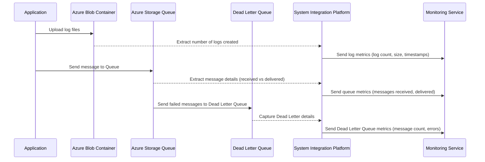
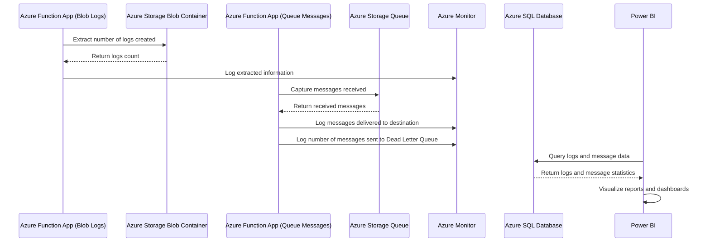

Here’s a detailed table and a corresponding Mermaid sequence diagram for your **System Integration Platform** connecting to **Azure Storage Blob Container** and **Azure Storage Queue**, focusing on capturing logs and message flow details such as messages received, delivered, and sent to the Dead Letter Queue.

### Detailed Table

| **Azure Resource**             | **Detailed Use Case**                                                                                                                                              | **Metrics to Monitor**                                                                                                             | **User Case**                                                                                                               |
|--------------------------------|--------------------------------------------------------------------------------------------------------------------------------------------------------------------|------------------------------------------------------------------------------------------------------------------------------------|----------------------------------------------------------------------------------------------------------------------------|
| **Azure Storage Blob Container**| This resource stores log files generated by various applications in the integration platform. The system extracts and counts the number of log files created daily. | - Number of logs created - Log size - File creation timestamp                                                                | The platform processes logs from different applications and extracts daily logs from the Blob Container for auditing.      |
| **Azure Storage Queue**        | Captures the number of messages received by the queue, the number of successfully processed messages, and the count of messages sent to the Dead Letter Queue.      | - Number of messages received - Number of messages delivered - Number of messages in Dead Letter Queue - Queue latency    | The platform monitors message flow, processing success rates, and error messages that are redirected to the Dead Letter Queue. |
| **Azure Dead Letter Queue**    | This is used to store messages that could not be processed successfully after multiple retries, helping in troubleshooting and error handling.                      | - Number of messages moved to the Dead Letter Queue - Error reason for Dead Letter messages - Timestamps of failed messages | Ensures that all unprocessable messages are captured for further analysis and troubleshooting via the Dead Letter Queue.    |

### Mermaid Sequence Diagram

The sequence diagram shows the flow from **log creation** in the **Azure Blob Container** to processing messages in the **Azure Storage Queue**, including the handling of messages in the **Dead Letter Queue**.

### Sequence Flow Explanation:

1. **Log File Upload**: 
   - The application uploads log files to the **Azure Blob Container**. 
   - The **System Integration Platform (SIPlatform)** extracts details like the number of logs created, their size, and timestamps from the Blob storage.

2. **Message Flow to Azure Queue**:
   - The application sends messages to the **Azure Storage Queue**. 
   - The **SIPlatform** monitors the message flow, capturing details about the number of messages received and delivered.

3. **Dead Letter Queue (DLQ)**:
   - Messages that cannot be processed successfully after multiple retries are sent to the **Dead Letter Queue (DLQ)**. 
   - The **SIPlatform** extracts error messages, failure reasons, and timestamps from the DLQ.

4. **Monitoring**:
   - The **Monitoring Service** is updated with metrics from both the **Blob Container** and **Storage Queue**, including the count of logs created, messages processed, and Dead Letter Queue details.

This flow allows efficient monitoring and error handling of logs and messages in your **System Integration Platform** connected to Azure Blob Storage and Azure Storage Queue. Let me know if you'd like further details or customizations!

I have provided the detailed table describing the use case where Power BI is connected to Azure resources, including Azure Function App, Blob Storage, Storage Queue, Azure Monitor, and Azure SQL. 

Now, let's create the **Mermaid Sequence Diagram** that illustrates the flow of data from the Azure Function App to Power BI:

### Explanation of the Flow:
1. **Azure Function App (Blob Logs)**: Extracts the number of logs created in the Blob Storage and logs this information to Azure Monitor.
2. **Azure Function App (Queue Messages)**: Captures messages from the Storage Queue and logs both successful deliveries and messages sent to the Dead Letter Queue in Azure Monitor.
3. **Power BI**: Queries Azure SQL to gather data on logs, messages received, and messages sent to the Dead Letter Queue. This data is visualized as reports and dashboards for monitoring.

This setup ensures robust monitoring and real-time reporting on log creation and message delivery. Let me know if you need further details!

# Data-Collection-Onprem-and-Azure-To-Power-Bi
| **Azure Resource**          | **Detailed Case**                                                                                                                                                    | **Collection Logs for Power BI**                                                                                                         | **Category** | **Azure DevOps(CI/CD) with Terraform**                                                                                       | **Diagnostics Logs**                                                                                                    | **Development**                                                                                                           | **Maintenance**                                                                                                                                                     |
|-----------------------------|----------------------------------------------------------------------------------------------------------------------------------------------------------------------|-----------------------------------------------------------------------------------------------------------------------------------------|--------------|-----------------------------------------------------------------------------------------------------------------------------|--------------------------------------------------------------------------------------------------------------------------|--------------------------------------------------------------------------------------------------------------------------|----------------------------------------------------------------------------------------------------------------------------------------------------------------------|
| **Azure Function App**       | Used to trigger and execute custom code for processing logs, transforming data, and publishing to Event Hub or Azure SQL for further analysis.                         | Collects and transforms logs before sending structured data to EventHub or SQL for Power BI.                                              | Compute      | Deployed using Azure DevOps Pipelines to automate function deployment and scaling.                                           | Processes diagnostic logs from various services to filter and store in Event Hub or Azure SQL.                          | Used in dev environments to quickly process and debug logs.                                                               | Maintained by updating function code and monitoring for performance.                                                                                                 |
| **Azure Storage**            | Central storage solution for keeping log data, diagnostic outputs, and intermediate data processed by other Azure services.                                           | Stores raw log data for later processing and querying.                                                                                   | Storage      | Provisioned via Terraform in CI/CD pipelines to automate storage account creation and configuration.                        | Stores raw or processed diagnostic logs for further analysis.                                                            | Holds test log data for development purposes.                                                                            | Monitored for capacity and performance to ensure data storage limits are not exceeded.                                                                              |
| **Azure Blob Containers**    | Blob Containers are used to store large volumes of logs or backup data that can be queried or processed for reporting or troubleshooting.                              | Stores processed or raw logs which can be linked to Power BI for reporting.                                                              | Storage      | Created and managed with Terraform to dynamically store and process logs.                                                    | Stores diagnostic logs from applications, making them accessible for processing.                                         | Stores development logs and application output for analysis.                                                             | Checked for lifecycle management to automatically delete old logs.                                                                                                 |
| **Azure Storage File Share** | File Share stores persistent logs generated by services like MoveIt SFTP or application diagnostics, accessible by multiple services.                                 | Persistent logs from SFTP, available for querying through Azure Function or direct integration with Power BI.                             | Storage      | Configured via Terraform to provide file share access for SFTP servers or applications in automated deployment processes.    | Stores diagnostics logs from applications or infrastructure components for later querying.                                | Stores persistent development logs for testing and debugging purposes.                                                   | Monitored to ensure logs are accessible and storage is properly allocated.                                                                                          |
| **Virtual Network**          | Enables secure communication between Azure services and helps segment network traffic, ensuring resources are only accessible to authorized services or users.         | Provides secure routing and access control for log collection and report generation in Power BI.                                          | Networking   | Provisioned via Terraform scripts to configure secure network connectivity for CI/CD processes.                             | Manages diagnostic logs traffic between resources securely.                                                              | Used to isolate development traffic from production environments.                                                       | Monitored for secure network configuration and throughput.                                                                                                         |
| **User Defined Route Table** | Custom routing for virtual networks to direct log data traffic between resources or to restrict traffic flows for better security and network control.                 | Routes logs to appropriate storage or processing resources, ensuring smooth data flow for Power BI.                                      | Networking   | Deployed with Terraform to ensure routing rules are set in line with organizational policies.                                | Directs diagnostic logs traffic to appropriate resources for further processing.                                          | Configures routing specific to development environments.                                                                | Reviewed to ensure routes remain valid and secure over time.                                                                                                        |
| **Azure EventHub**           | Ingests large volumes of logs in real-time, supporting scalability for applications that generate significant amounts of diagnostic or transactional logs.            | Provides real-time log data ingestion, supporting near real-time reporting in Power BI dashboards.                                        | Messaging    | Configured using Terraform to automate setup of event hub for log ingestion.                                                 | Ingests diagnostic logs from various sources for real-time processing.                                                   | Ingests dev logs for real-time testing and validation.                                                                  | Maintained to handle high-volume log ingestion and scalability.                                                                                                     |
| **Azure SQL**                | Structured storage of log data, allowing complex queries and data analysis, serving as a reliable backend for reporting tools like Power BI.                          | Stores structured log data, enabling Power BI to directly query and visualize logs.                                                       | Database     | Automated using Terraform to provision SQL databases for log storage and querying.                                           | Stores diagnostic logs for easy access and analysis.                                                                     | Stores structured dev logs for further analysis.                                                                         | Monitored for performance and query efficiency.                                                                                                                     |
| **Power BI**                 | Power BI connects to data sources like Azure SQL to generate dashboards, visualizing log data trends, diagnostics, and business KPIs.                                | Generates reports and dashboards by querying structured data from Azure SQL or Blob storage.                                              | Analytics    | Integrated with Azure DevOps for continuous reporting updates using data connectors.                                         | Visualizes diagnostic logs trends and patterns in real-time or near-real-time.                                            | Connects to dev databases and datasets to create test reports.                                                           | Monitored to ensure dashboards are up-to-date and connected data sources are active.         

