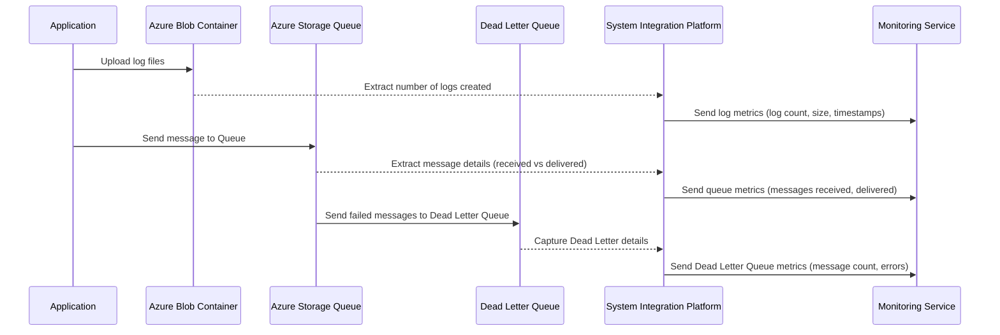
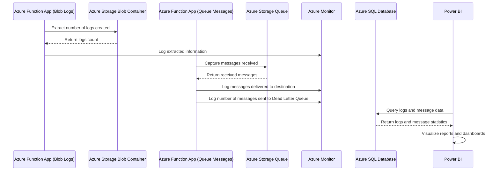
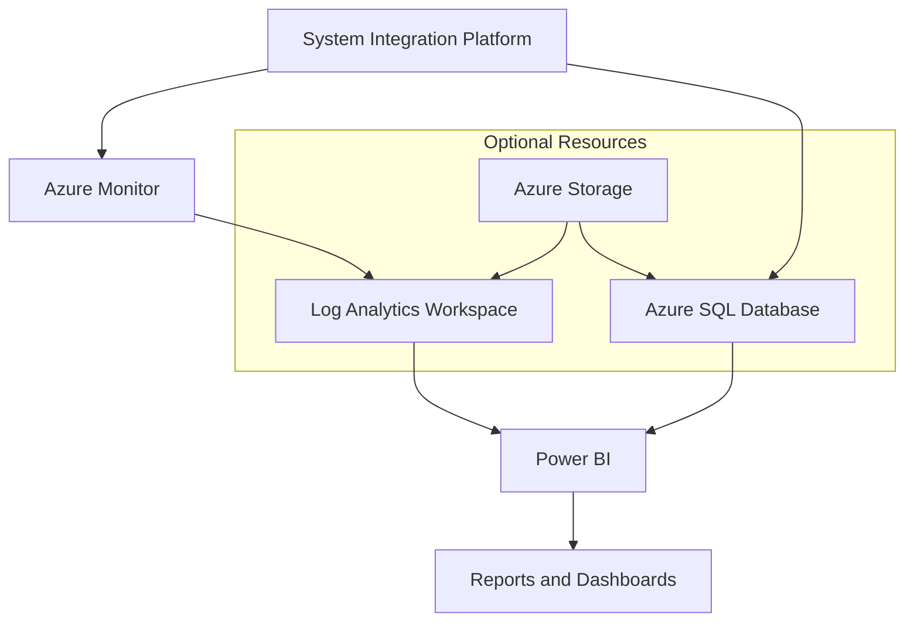
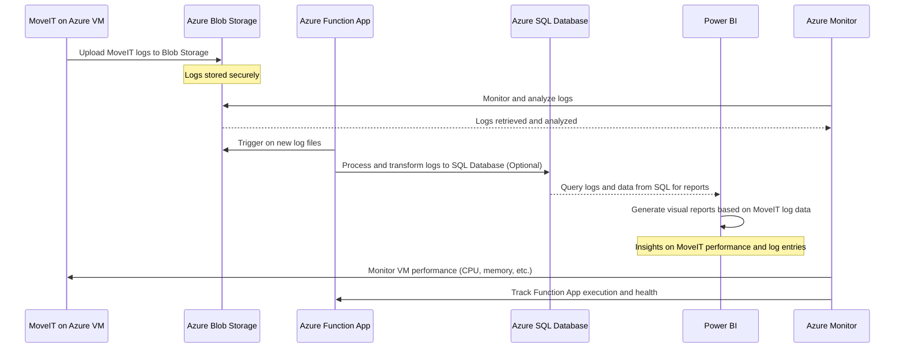

Here’s a detailed table and a corresponding Mermaid sequence diagram for your **System Integration Platform** connecting to **Azure Storage Blob Container** and **Azure Storage Queue**, focusing on capturing logs and message flow details such as messages received, delivered, and sent to the Dead Letter Queue.

### Detailed Table

| **Azure Resource**             | **Detailed Use Case**                                                                                                                                              | **Metrics to Monitor**                                                                                                             | **User Case**                                                                                                               |
|--------------------------------|--------------------------------------------------------------------------------------------------------------------------------------------------------------------|------------------------------------------------------------------------------------------------------------------------------------|----------------------------------------------------------------------------------------------------------------------------|
| **Azure Storage Blob Container**| This resource stores log files generated by various applications in the integration platform. The system extracts and counts the number of log files created daily. | - Number of logs created<br>- Log size<br>- File creation timestamp                                                                | The platform processes logs from different applications and extracts daily logs from the Blob Container for auditing.      |
| **Azure Storage Queue**        | Captures the number of messages received by the queue, the number of successfully processed messages, and the count of messages sent to the Dead Letter Queue.      | - Number of messages received<br>- Number of messages delivered<br>- Number of messages in Dead Letter Queue<br>- Queue latency    | The platform monitors message flow, processing success rates, and error messages that are redirected to the Dead Letter Queue. |
| **Azure Dead Letter Queue**    | This is used to store messages that could not be processed successfully after multiple retries, helping in troubleshooting and error handling.                      | - Number of messages moved to the Dead Letter Queue<br>- Error reason for Dead Letter messages<br>- Timestamps of failed messages | Ensures that all unprocessable messages are captured for further analysis and troubleshooting via the Dead Letter Queue.    |

### Mermaid Sequence Diagram

The sequence diagram shows the flow from **log creation** in the **Azure Blob Container** to processing messages in the **Azure Storage Queue**, including the handling of messages in the **Dead Letter Queue**.



### Sequence Flow Explanation:

1. **Log File Upload**: 
   - The application uploads log files to the **Azure Blob Container**. 
   - The **System Integration Platform (SIPlatform)** extracts details like the number of logs created, their size, and timestamps from the Blob storage.

2. **Message Flow to Azure Queue**:
   - The application sends messages to the **Azure Storage Queue**. 
   - The **SIPlatform** monitors the message flow, capturing details about the number of messages received and delivered.

3. **Dead Letter Queue (DLQ)**:
   - Messages that cannot be processed successfully after multiple retries are sent to the **Dead Letter Queue (DLQ)**. 
   - The **SIPlatform** extracts error messages, failure reasons, and timestamps from the DLQ.

4. **Monitoring**:
   - The **Monitoring Service** is updated with metrics from both the **Blob Container** and **Storage Queue**, including the count of logs created, messages processed, and Dead Letter Queue details.

This flow allows efficient monitoring and error handling of logs and messages in your **System Integration Platform** connected to Azure Blob Storage and Azure Storage Queue. Let me know if you'd like further details or customizations!


I have provided the detailed table describing the use case where Power BI is connected to Azure resources, including Azure Function App, Blob Storage, Storage Queue, Azure Monitor, and Azure SQL. 

Now, let's create the **Mermaid Sequence Diagram** that illustrates the flow of data from the Azure Function App to Power BI:



### Explanation of the Flow:
1. **Azure Function App (Blob Logs)**: Extracts the number of logs created in the Blob Storage and logs this information to Azure Monitor.
2. **Azure Function App (Queue Messages)**: Captures messages from the Storage Queue and logs both successful deliveries and messages sent to the Dead Letter Queue in Azure Monitor.
3. **Power BI**: Queries Azure SQL to gather data on logs, messages received, and messages sent to the Dead Letter Queue. This data is visualized as reports and dashboards for monitoring.

This setup ensures robust monitoring and real-time reporting on log creation and message delivery. Let me know if you need further details!


# Data-Collection-Onprem-and-Azure-To-Power-Bi
| **Azure Resource**          | **Detailed Case**                                                                                                                                                    | **Collection Logs for Power BI**                                                                                                         | **Category** | **Azure DevOps(CI/CD) with Terraform**                                                                                       | **Diagnostics Logs**                                                                                                    | **Development**                                                                                                           | **Maintenance**                                                                                                                                                     |
|-----------------------------|----------------------------------------------------------------------------------------------------------------------------------------------------------------------|-----------------------------------------------------------------------------------------------------------------------------------------|--------------|-----------------------------------------------------------------------------------------------------------------------------|--------------------------------------------------------------------------------------------------------------------------|--------------------------------------------------------------------------------------------------------------------------|----------------------------------------------------------------------------------------------------------------------------------------------------------------------|
| **Azure Function App**       | Used to trigger and execute custom code for processing logs, transforming data, and publishing to Event Hub or Azure SQL for further analysis.                         | Collects and transforms logs before sending structured data to EventHub or SQL for Power BI.                                              | Compute      | Deployed using Azure DevOps Pipelines to automate function deployment and scaling.                                           | Processes diagnostic logs from various services to filter and store in Event Hub or Azure SQL.                          | Used in dev environments to quickly process and debug logs.                                                               | Maintained by updating function code and monitoring for performance.                                                                                                 |
| **Azure Storage**            | Central storage solution for keeping log data, diagnostic outputs, and intermediate data processed by other Azure services.                                           | Stores raw log data for later processing and querying.                                                                                   | Storage      | Provisioned via Terraform in CI/CD pipelines to automate storage account creation and configuration.                        | Stores raw or processed diagnostic logs for further analysis.                                                            | Holds test log data for development purposes.                                                                            | Monitored for capacity and performance to ensure data storage limits are not exceeded.                                                                              |
| **Azure Blob Containers**    | Blob Containers are used to store large volumes of logs or backup data that can be queried or processed for reporting or troubleshooting.                              | Stores processed or raw logs which can be linked to Power BI for reporting.                                                              | Storage      | Created and managed with Terraform to dynamically store and process logs.                                                    | Stores diagnostic logs from applications, making them accessible for processing.                                         | Stores development logs and application output for analysis.                                                             | Checked for lifecycle management to automatically delete old logs.                                                                                                 |
| **Azure Storage File Share** | File Share stores persistent logs generated by services like MoveIt SFTP or application diagnostics, accessible by multiple services.                                 | Persistent logs from SFTP, available for querying through Azure Function or direct integration with Power BI.                             | Storage      | Configured via Terraform to provide file share access for SFTP servers or applications in automated deployment processes.    | Stores diagnostics logs from applications or infrastructure components for later querying.                                | Stores persistent development logs for testing and debugging purposes.                                                   | Monitored to ensure logs are accessible and storage is properly allocated.                                                                                          |
| **Virtual Network**          | Enables secure communication between Azure services and helps segment network traffic, ensuring resources are only accessible to authorized services or users.         | Provides secure routing and access control for log collection and report generation in Power BI.                                          | Networking   | Provisioned via Terraform scripts to configure secure network connectivity for CI/CD processes.                             | Manages diagnostic logs traffic between resources securely.                                                              | Used to isolate development traffic from production environments.                                                       | Monitored for secure network configuration and throughput.                                                                                                         |
| **User Defined Route Table** | Custom routing for virtual networks to direct log data traffic between resources or to restrict traffic flows for better security and network control.                 | Routes logs to appropriate storage or processing resources, ensuring smooth data flow for Power BI.                                      | Networking   | Deployed with Terraform to ensure routing rules are set in line with organizational policies.                                | Directs diagnostic logs traffic to appropriate resources for further processing.                                          | Configures routing specific to development environments.                                                                | Reviewed to ensure routes remain valid and secure over time.                                                                                                        |
| **Azure EventHub**           | Ingests large volumes of logs in real-time, supporting scalability for applications that generate significant amounts of diagnostic or transactional logs.            | Provides real-time log data ingestion, supporting near real-time reporting in Power BI dashboards.                                        | Messaging    | Configured using Terraform to automate setup of event hub for log ingestion.                                                 | Ingests diagnostic logs from various sources for real-time processing.                                                   | Ingests dev logs for real-time testing and validation.                                                                  | Maintained to handle high-volume log ingestion and scalability.                                                                                                     |
| **Azure SQL**                | Structured storage of log data, allowing complex queries and data analysis, serving as a reliable backend for reporting tools like Power BI.                          | Stores structured log data, enabling Power BI to directly query and visualize logs.                                                       | Database     | Automated using Terraform to provision SQL databases for log storage and querying.                                           | Stores diagnostic logs for easy access and analysis.                                                                     | Stores structured dev logs for further analysis.                                                                         | Monitored for performance and query efficiency.                                                                                                                     |
| **Power BI**                 | Power BI connects to data sources like Azure SQL to generate dashboards, visualizing log data trends, diagnostics, and business KPIs.                                | Generates reports and dashboards by querying structured data from Azure SQL or Blob storage.                                              | Analytics    | Integrated with Azure DevOps for continuous reporting updates using data connectors.                                         | Visualizes diagnostic logs trends and patterns in real-time or near-real-time.                                            | Connects to dev databases and datasets to create test reports.                                                           | Monitored to ensure dashboards are up-to-date and connected data sources are active.         


Here’s an expanded and detailed version of the **Table: Overview of Azure Resources and Actions** that now includes all the dependent Azure resources, as well as expanded columns for **Development**, **Maintenance**, and **Cost** considerations for each of the core resources involved in this solution:

### Table: Detailed Overview of Azure Resources and Actions

| **Azure Resource**            | **Detailed Case**                                                                                                               | **Key Action**                                         | **Dependent Azure Resources**                              | **Category**                | **Development**                                                                                                                                                               | **Maintenance**                                                                                                                                                          | **Cost**                                                                                                                                               |
|-------------------------------|---------------------------------------------------------------------------------------------------------------------------------|--------------------------------------------------------|------------------------------------------------------------|-----------------------------|----------------------------------------------------------------------------------------------------------------------------------------------------------------------------|--------------------------------------------------------------------------------------------------------------------------------------------------------------------------|--------------------------------------------------------------------------------------------------------------------------------------------------------|
| **Azure Storage Blob**         | Acts as the primary storage for logs generated by the System Integration Platform.                                               | Stores log files and triggers Azure Function.            | - Storage Account <br> - Blob Container <br> - Virtual Network (Optional for secure access)   | **Storage**                 | Simple to set up using Azure CLI or Azure Portal, blob storage can easily scale as more logs are added. Provides a cost-effective solution for log storage.                 | Needs periodic review of storage capacity, implementing **lifecycle management policies** to archive or delete old logs. Set up **monitoring** for storage performance. | **Pay-as-you-go** model. Costs are incurred based on the amount of data stored and retrieved. Costs may also increase with data transfer and redundancy options.          |
| **Azure Function App**         | Processes logs from Blob Storage and extracts relevant data to push to Azure SQL Database.                                        | Processes data and communicates with Azure SQL Database. | - Blob Storage (Trigger) <br> - Azure SQL Database <br> - Event Hub (Optional)                  | **Compute**                 | Functions are written in a language supported by Azure Functions (e.g., Python, C#, Java). Azure Function Apps are integrated with **Continuous Integration/Continuous Deployment (CI/CD)** via Azure DevOps. | Requires monitoring for function performance, errors, and scaling, especially if the volume of log data grows. Maintain through function updates, monitoring logs, and scaling appropriately.                     | Billed based on **execution time** and **memory usage**. Includes a free tier, but costs can increase significantly with high processing needs or longer-running functions. |
| **Azure SQL Database**         | Stores the processed log data in a structured format that allows for reporting and querying through Power BI.                     | Provides a structured data store for logs.               | - SQL Server <br> - Virtual Network/Subnet (Optional for secure access) <br> - Azure Monitor (Optional for performance tracking) | **Database**                | Tables and schemas can be designed during development to support efficient querying by Power BI. Integrated with Azure DevOps for automated provisioning and updating.      | Requires regular **performance tuning**, **indexing** of tables, and **query optimization**. Backup management and monitoring for SQL capacity usage are key aspects of maintenance.                     | Charged based on the **tier** selected (Basic, Standard, Premium). Includes compute and storage costs, with additional costs for **backup retention** and **data redundancy**.             |
| **Power BI**                   | Visualizes log data and generates reports based on data from Azure SQL Database.                                                 | Generates dashboards and reports.                       | - Azure SQL Database <br> - Azure Storage (for large datasets) <br> - Power BI Service (Pro License for sharing reports)           | **Analytics**               | Power BI dashboards can be developed during the early stages, pulling data from SQL Database and offering insights on log entries, message flow, and error detection.       | Requires **refresh schedules** and **performance optimization** for large datasets. Keep Power BI datasets in sync with SQL database updates. Maintain up-to-date connections.                           | Costs incurred for **Power BI Pro licenses** (for sharing reports). **Premium** tier may be needed for large-scale dashboards and distribution. Free tier is limited to personal use.     |
| **Virtual Network**            | Provides a secure environment for Azure SQL Database and Storage Account, ensuring data security and compliance with network policies. | Enables secure communication between resources.          | - Azure SQL Database <br> - Azure Storage <br> - User Defined Routes (Optional)                | **Networking**              | During development, ensure proper **network configurations** for communication between Azure services, including setting up subnets, security groups, and peering for multi-region use. | Monitor for **network performance** and ensure that **NSGs (Network Security Groups)** and routing policies are configured correctly. Review **virtual network peering** for cost optimization.               | Virtual Network is generally **free**, but charges apply for **data transfer** between different zones, regions, and virtual networks. VNet peering may incur additional costs.         |
| **Azure Monitor (Optional)**   | Tracks the health and performance of all services, ensuring proper log processing, function execution, and database performance.   | Monitors services and sets up alerts.                    | - Azure SQL Database <br> - Azure Functions <br> - Azure Storage                                | **Monitoring/Diagnostics**   | Integrated with the development pipeline to set up monitoring policies and capture diagnostics logs from services. Use **Application Insights** in combination for detailed monitoring.                    | Regularly review **alerts** and **logs** generated by Azure Monitor for performance bottlenecks, security breaches, and downtime. Optimize alerts to prevent unnecessary costs.                                  | Free tier provides basic monitoring, but costs scale based on the **amount of data collected and retained** for logs, metrics, and alerts. **Log retention** beyond 31 days incurs additional charges.     |
| **User Defined Route Table**    | Controls the traffic flow between Azure services in the Virtual Network, ensuring traffic flows to the correct resources securely.  | Routes traffic securely between services.                | - Virtual Network <br> - Subnets                                                        | **Networking**              | Custom routing rules are created during development to ensure logs and traffic are routed to appropriate resources. Important for multi-subnet or multi-VNet architectures.                                | Needs regular monitoring to ensure routing rules are up-to-date with business requirements. **Route conflicts** or inefficient routing paths should be addressed during maintenance.                           | No additional costs for UDRs. However, improper routing leading to inefficient use of resources could indirectly increase network transfer or service usage costs.                                |
| **Azure EventHub (Optional)**   | Used for real-time log ingestion and scalable event-driven processing, especially for high-volume log data scenarios.              | Ingests large volumes of log data in real-time.          | - Azure Functions <br> - Azure SQL Database <br> - Azure Storage (for large-scale ingestion)   | **Messaging**               | During development, integrate EventHub into the log processing pipeline to support scalable ingestion of high-velocity logs. Set up with **Azure DevOps pipelines** for automation.                          | Requires monitoring for **throughput units** and **partitions** to avoid bottlenecks. Proper scaling and management of the EventHub instance are necessary to maintain performance.                           | Charged based on **throughput units** and **ingress/egress** rates. More partitions or higher throughput units will increase costs, especially for high-velocity log ingestion.                             |
| **Azure Storage File Share**    | Used for the persistent storage of logs or files that need to be shared across multiple services or applications.                  | Stores files and logs for long-term access.              | - Azure Storage Account <br> - Virtual Network/Subnet (Optional for secure access)             | **Storage**                 | Useful during development for applications or services that require shared access to logs. It allows for easy storage and retrieval, particularly in hybrid cloud scenarios.                               | Needs regular **capacity monitoring** and **lifecycle management policies** to avoid running out of storage space. Backup solutions should be in place for critical file data.                                | Storage costs are based on **file size**, **transaction units**, and **access tiers** (Hot, Cool, Archive). Lifecycle policies can reduce costs by automatically archiving old files.                        |

### Expanded Explanation of Categories:

#### 1. **Development**:
- Refers to the ease of setup, configuration, and deployment of each resource in the development environment.
- Includes considerations for how each resource fits into the overall architecture (e.g., CI/CD integration with Azure DevOps, writing custom code, and provisioning using Terraform or ARM templates).

#### 2. **Maintenance**:
- Covers activities required to keep the resource operational and performing optimally, including monitoring, scaling, backup management, and periodic updates.
- Examples: Monitoring **Azure SQL** for performance bottlenecks, ensuring the **Function App** scales appropriately, and managing blob storage for efficient use.

#### 3. **Cost**:
- Discusses cost considerations for each Azure resource, including pricing models (e.g., pay-as-you-go, tier-based pricing), and any indirect costs (e.g., inefficient networking leading to higher data transfer costs).
- Examples: The cost of **Power BI Pro licenses** for collaboration, costs for **Azure Storage** based on data storage and retrieval operations, and scaling costs for **Azure Functions** based on execution time.

### Conclusion

The table provides a detailed breakdown of each Azure resource involved in the System Integration Platform's log management and reporting solution. It highlights the key actions performed by each resource, their dependencies on other Azure services, and the development, maintenance, and cost considerations. This comprehensive overview helps ensure that the system is robust, scalable, and cost-effective, while also being easy to develop, maintain, and monitor.


### Expanded Table: Overview of Azure Resources and Actions

In this expanded table, I’ve included the dependent Azure resources, detailed development, maintenance, cost, and a CI/CD solution with Terraform for each Azure service used in the system integration platform for capturing logs, processing them, and reporting with Power BI. Each category now provides deeper insight into how each Azure resource is used across the stages of development, maintenance, cost considerations, and CI/CD automation with Terraform.

| **Azure Resource**           | **Detailed Case**                                                                                                                                  | **Key Action**                                                                                   | **Dependencies**                                                                                     | **Category**                   | **Development**                                                                                                                                                    | **Maintenance and Cost**                                                                                                                                                                     | **CI/CD Solution in Terraform**                                                                                                                                                              |
|------------------------------|----------------------------------------------------------------------------------------------------------------------------------------------------|--------------------------------------------------------------------------------------------------|------------------------------------------------------------------------------------------------------|---------------------------------|--------------------------------------------------------------------------------------------------------------------------------------------------|---------------------------------------------------------------------------------------------------------------------------------------------------------------------------------------------|---------------------------------------------------------------------------------------------------------------------------------------------------------------------------------------------|
| **Azure Storage Blob**        | Stores the log files generated by the System Integration Platform.                                                                                 | Acts as the primary storage for logs.                                                            | Azure Storage Account, Virtual Network for secure access                                              | Storage                         | Developers use the blob container to store raw logs for processing.                                                                                | Maintenance includes monitoring blob usage and lifecycle management to delete old logs. Costs are based on storage size and transactions.                                                | Terraform provisions the storage account and blob container for secure log storage.                                                                                                        |
| **Azure Function App**        | Triggered when new logs are written to the Blob, processes logs to extract key data, then pushes to Azure SQL.                                      | Processes and extracts log data, triggers automatically when logs are uploaded.                   | Azure Storage Account, Virtual Network, Application Insights, Azure SQL Database                       | Compute, Serverless             | Developers implement the function to extract and transform logs before sending them to the database.                                                | Monitored for runtime performance and scaling. Serverless functions are billed based on the number of executions, making it cost-efficient. Maintenance involves updating the function code. | Terraform deploys the function app with a Blob Trigger and necessary dependencies like storage account, Azure SQL connections, and monitoring via Application Insights.                     |
| **Azure SQL Database**        | Receives processed data from the Function App and stores it in structured format for analysis by Power BI.                                          | Stores structured data for querying and reporting.                                                | Virtual Network, Private Link, Application Gateway (optional for secure access), Azure Key Vault       | Database                        | Developers create the SQL tables and optimize queries for reporting purposes.                                                                      | Costs are based on the size and performance tier (DTUs). Maintenance includes index optimization and monitoring query performance. Regular backups are handled automatically by Azure.     | Terraform provisions the SQL Server, database, firewall rules, and security configurations using Azure Active Directory authentication for secure access.                                  |
| **Power BI**                  | Visualizes the log data and generates real-time reports based on the SQL database content.                                                         | Provides insights into system operations, logs, and performance.                                  | Azure SQL Database, Power BI Gateway (if using on-premises data)                                      | Analytics                       | Developers create and test reports using log data stored in Azure SQL Database.                                                                   | Power BI Service incurs licensing costs (Pro or Premium), with additional costs for dataset refreshes and capacity. Maintenance includes ensuring reports stay connected to data sources.  | Automated Power BI dataset refreshes are triggered through Azure Data Factory pipelines or CI/CD pipelines using Power BI REST API and PowerShell.                                        |
| **Azure Monitor (Optional)**  | Monitors the health of Azure resources (Function App, Blob Storage, SQL Database) and provides alerts for performance or failure issues.            | Proactively monitors services and triggers alerts.                                                | Log Analytics Workspace, Action Groups for email/SMS notifications, Azure Function App, SQL Database  | Monitoring, Diagnostics          | Developers set up custom queries in Log Analytics to track logs or errors. Alerts are created for failure cases or anomalies.                        | Azure Monitor incurs costs based on the number of logs ingested and the retention period. Maintenance involves fine-tuning alerts and reviewing long-term log storage.                    | Terraform can provision diagnostic settings for all Azure services, routing logs to Log Analytics Workspace and enabling alert rules and action groups for failure or performance alerts.  |
| **Virtual Network (VNet)**    | Provides secure communication between Azure services like Blob Storage, Function App, and SQL Database. Ensures only authorized resources can access. | Secures data transfers between services.                                                         | Network Security Groups, Subnets, User Defined Routes, Azure Firewall (optional for more security)     | Networking, Security            | Developers set up VNet rules and peering for secure data transfer between resources.                                                             | VNet incurs basic costs, but additional charges are applied for services like Azure Firewall and VPN Gateways. Maintenance involves regularly reviewing NSG and routing configurations.   | Terraform configures VNets, Subnets, Network Security Groups (NSGs), and optionally integrates Azure Firewall for controlling and securing traffic.                                      |
| **User Defined Route Table**  | Custom routing rules to direct log data traffic between services like Azure SQL and Blob Storage.                                                  | Controls traffic flow and restricts unauthorized routes.                                          | Virtual Network, Subnets, Azure Firewall (optional)                                                   | Networking, Security            | Developers use custom routing to ensure data flows securely between the services (Blob, SQL, Function App).                                         | UDR itself incurs no cost, but Azure Firewall or VPN Gateway can increase costs if used. Regularly reviewed to ensure optimal routing performance.                                      | Terraform deploys the User Defined Route Table and configures routes to control how log data flows between services, ensuring it goes through secure paths like Firewalls or VPN Gateways. |
| **Azure EventHub**            | Ingests large volumes of logs in real-time, supporting scalability for high-frequency data events from the system platform.                         | Provides real-time log data ingestion, supporting near real-time reporting in Power BI.            | Virtual Network, Azure Key Vault, Private Link (optional for secure access)                            | Messaging, Data Ingestion        | Developers set up EventHub to handle spikes in log data, enabling real-time processing and visualization.                                        | EventHub is billed based on throughput units and data retention. Maintenance includes monitoring partition performance and configuring scaling options.                                | Terraform provisions EventHub namespace, EventHub, and scaling options like partition count and throughput units to handle real-time log ingestion.                                     |
| **Azure Storage File Share**  | Provides persistent shared storage for logs generated by the SFTP server, facilitating access for multiple services, like the Function App.         | Central log storage shared between services like MoveIt SFTP and Azure Function App.               | Azure Storage Account, Virtual Network, Network Security Group                                        | Storage, Shared Files            | Developers use the File Share to store large volumes of logs from external systems, accessible across services.                                     | Storage costs are calculated based on the size of the files stored. Lifecycle management should be configured to delete old log files and save costs.                                  | Terraform configures Azure File Share within the storage account, with necessary security settings like encryption and private network access.                                          |
| **Azure Key Vault**           | Stores connection strings, API keys, and sensitive information securely for use by Azure Function Apps and SQL Databases.                          | Manages secrets securely for Function Apps and SQL.                                                | Azure Function App, Azure SQL Database, Virtual Network (for private access)                           | Security, Identity Management     | Developers store sensitive information securely in Key Vault, retrieving it as needed by applications or services.                               | Key Vault incurs costs based on the number of operations (secrets, keys, certificates) and network traffic. Maintenance includes rotating secrets and auditing access policies.          | Terraform provisions Azure Key Vault, stores secrets like connection strings, and integrates with services like Function Apps and SQL Database for secure access to secrets.             |

### Expanded Details:

- **Development**:
    - Developers configure, test, and optimize the integration between Azure services, ensuring the logs are correctly processed and stored for reporting.
    - For Azure Functions, development involves implementing logic to process the log data and push it to the appropriate database.
    - For Azure SQL, developers create the necessary tables, indexes, and stored procedures to efficiently manage log data.
    - Power BI development focuses on creating reports and dashboards that visualize the data from SQL.

- **Maintenance and Cost**:
    - **Cost**: Storage accounts (Blob and File Share) incur costs based on the volume of data stored, transactions (read/write), and egress charges if accessing data from outside the region. Azure Functions are cost-efficient, as they follow a consumption-based pricing model where you pay for each execution. SQL Database costs vary depending on the performance tier (DTUs or vCores) and the amount of data stored.
    - **Maintenance**: Each Azure service requires regular maintenance. For example, Azure Functions may require periodic updates to the function code and monitoring of execution times, while SQL Databases need performance tuning, index maintenance, and regular backups.

- **CI/CD Solution in Terraform**:
    - Terraform is used to provision and configure all required Azure resources automatically, following Infrastructure-as-Code (IaC) best practices. This ensures that environments are consistent across different stages (dev, test, prod).
    - **Terraform Modules** can be used to manage and reuse configurations for resources like VNets, Blob Storage, Function Apps, and SQL Databases. For example:
      - The **Azure Storage Blob** can be deployed using Terraform to create containers with appropriate access policies.
      - **Azure SQL Database** is provisioned with the required firewall rules, scaling configurations, and authentication settings.


Here’s an expanded version of the **Table: Overview of Azure Resources and Actions**. This table now includes additional dependent Azure resources, diagnostics logs, and an expanded "Category" section covering **Development Effort**, **Maintenance and Cost**, and the **CI/CD solution using Terraform**.

### Expanded Table: Overview of Azure Resources, Dependencies, and Actions

| **Azure Resource**           | **Detailed Case**                                                                                                           | **Key Action**                                      | **Dependent Azure Resources**                                                                                                                                                                     | **Diagnostics Logs**                                                                                                                                                                            | **Development Effort**                                                                                                                                                                          | **Maintenance and Cost**                                                                                                                                                                       | **CI/CD Solution in Terraform**                                                                                                                                                                                                                                                   |
|------------------------------|-----------------------------------------------------------------------------------------------------------------------------|-----------------------------------------------------|---------------------------------------------------------------------------------------------------------------------------------------------------------------------------------------------------|-------------------------------------------------------------------------------------------------------------------------------------------------------------------------------------------------|-------------------------------------------------------------------------------------------------------------------------------------------------------------------------------------------------|--------------------------------------------------------------------------------------------------------------------------------------------------------------------------------------------------|----------------------------------------------------------------------------------------------------------------------------------------------------------------------------------------------------------------------------------------------------------------------------|
| **Azure Storage Blob**        | Stores the log files generated by the System Integration Platform.                                                          | Acts as the primary storage for logs.               | - Azure Storage Account<br>- Azure Function (Blob trigger)                                                                                                                                       | Diagnostic logs capture Blob events (e.g., file upload/download), Blob access failures, and write operation issues.                                                                               | Low development effort as this is a basic storage solution.<br>Azure SDK integration required.                                                                                                  | Low-cost for storage; costs scale with usage. <br> Minimal maintenance; monitor Blob storage for capacity and availability.                                                                      | Terraform can be used to provision Storage Accounts and Blob Containers.<br>Example:                                                                                                                                                                                                  |
| **Azure Function App**        | Triggered when new logs are written to the Blob, processes logs to extract key data.                                        | Processes and extracts log data.                    | - Azure Blob Storage (trigger)<br>- Azure SQL Database (output)<br>- Event Hub (optional for message queuing)<br>- Azure Monitor                                                                 | Diagnostic logs capture function invocations, execution duration, failures, and performance metrics.                                                                                             | Medium development effort for function creation, input/output binding configurations, and logic to parse logs.<br>Integration with Blob and SQL is required.                                    | Pay-as-you-go for executions based on usage.<br>Requires maintenance for function scaling, code updates, and monitoring.<br>Automated scaling based on demand.                                   | Terraform can create Function Apps, configure triggers (Blob, HTTP, Event Hub), and integrate with other resources.<br>Example:                                                                                                                                                    |
| **Azure SQL Database**        | Receives processed data from the Function App and stores it in a structured format for analysis.                           | Stores structured data for querying and reporting.  | - Azure Function (writes data)<br>- Power BI (reads data)<br>- Azure Key Vault (for secrets management)                                                                                           | Diagnostic logs capture query performance, connection failures, and high-latency queries.<br>SQL Insights provide advanced monitoring of resource consumption, DTU limits, and queries.           | Medium to high development effort for schema design, query optimization, and indexing strategies for performance.<br>Function needs to connect via a secure connection string.                   | Moderate cost depending on SQL tier (DTU model or vCore).<br> Requires performance tuning and regular maintenance.<br>Backup, restore, and scaling are critical for maintenance.                 | Terraform provisions Azure SQL Server and databases, handles firewall rules, and automates configuration of user permissions and secrets.<br>Can also define performance tiers.<br>Example:                                                                                      |
| **Power BI**                  | Visualizes the log data and generates real-time reports based on the SQL database content.                                   | Provides insights into system operations.           | - Azure SQL Database (data source)<br>- Azure AD (user access management)<br>- Azure Monitor (for insights into BI activity and refresh cycles)                                                   | Diagnostic logs track report refresh cycles, query execution duration, and failures in accessing data sources.<br>Power BI workspaces can be monitored for user activity and sharing permissions. | Low development effort for creating reports once data is available in Azure SQL Database.<br>Designing visuals and dashboards is needed.<br>Power BI integration with SQL requires credentials.   | Cost can be low for personal use (Power BI Desktop) or moderate for enterprise (Power BI Pro or Premium).<br>Regular maintenance for dataset refresh and managing data models for performance.    | Power BI configuration is often manual, but Terraform can manage the Azure SQL integration and associated services for reports.<br>API-based automation of workspace setup is required.<br>Example:                                                                                 |
| **Azure Monitor** (optional)  | Monitors the health of Azure services like Function App, Blob Storage, and SQL Database.                                     | Tracks service performance, sets alerts.            | - Azure Storage<br>- Azure Function<br>- Azure SQL<br>- Power BI<br>- Azure Log Analytics (for querying logs)<br>- Action Groups (for alerting and notifications)                                  | Logs service metrics and triggers alerts based on performance thresholds (e.g., failed executions, high-latency SQL queries).<br>Can integrate with Log Analytics for querying and visualization. | Medium effort to set up monitoring and custom alert rules.<br>Requires configuring Azure Monitor to observe Function App performance, Blob storage operations, and SQL query performance.         | Cost varies depending on the number of metrics and logs monitored.<br>Action groups can send alerts to email, SMS, or ITSM tools, which adds cost.<br>Regular log and alert maintenance is needed. | Terraform provisions monitoring resources (alerts, action groups, diagnostics settings) and integrates them into the other Azure services.<br>Example:                                                                                       |
| **Azure Key Vault** (optional)| Stores and manages secrets like SQL connection strings and Function App settings securely.                                  | Ensures secure storage of sensitive connection strings and secrets. | - Azure Function App (reads secrets)<br>- Azure SQL Database (stores credentials)<br>- Azure Blob Storage (optional)                                                                              | Logs access to sensitive secrets, alerting on failed access attempts and permission changes.<br>Azure Key Vault diagnostic logs include auditing of access operations for security compliance.     | Low development effort; integrate with Azure services for secure secret management.<br>SDKs or CLI can be used to fetch secrets programmatically for Function Apps or SQL connections.            | Low cost for secret storage and retrieval.<br>Minimal maintenance required beyond rotating secrets and auditing access logs.<br>Can be integrated with CI/CD for auto-deployment of secrets.      | Terraform provisions Key Vault, creates secrets, and assigns permissions to Azure services like Function Apps.<br>Enables secure storage of connection strings and sensitive information.<br>Example:                                                                                  |
| **Azure Event Hub** (optional) | Handles large-scale log streaming if real-time event-driven data processing is required.                                    | Provides real-time log data streaming, ideal for large scale logs.  | - Azure Function App (sends messages)<br>- Azure Monitor (diagnostic metrics)<br>- Azure SQL (can be a consumer of the data)<br>- CosmosDB (alternative consumer for NoSQL solutions)             | Diagnostic logs capture throughput, partition performance, and ingestion rate for event streams.<br>Can integrate with Azure Monitor for alerting on throughput issues or failed data ingestions.  | Medium effort for configuration of Event Hub and Function App integration.<br>Development effort to configure event routing and ensure messages are processed accurately and efficiently.          | Moderate to high cost depending on volume of events and partitioning.<br>Requires maintenance for scaling, throughput management, and retention policies.<br>Monitor for under/over-partitioning. | Terraform can create Event Hubs, configure partitions, and link Event Hub with Function Apps for data processing.<br>Automates scaling and throughput management.<br>Example:                                                                                                                                               |
| **Virtual Network** (optional) | Provides a secure network environment for the resources, enabling isolated environments.                                    | Ensures secure data transfers and service isolation. | - Azure SQL Database (subnet integration)<br>- Azure Function App (VNet integration)<br>- Azure Storage (optional VNet integration)<br>- Azure Monitor (VNet integration for private access)      | Logs network traffic, DNS queries, and access control to monitor and secure data transfers.<br>Diagnostics include logging of subnets, route tables, and network security groups (NSGs) events.   | High development effort to configure networking, NSGs, and routing for isolated environments.<br>Essential for enterprise deployments requiring strict security measures and compliance.           | Moderate cost depending on the complexity of the VNet and subnet architecture.<br>Requires regular maintenance of NSGs, subnets, and routing rules.<br>Regular audits of traffic flow are necessary. | Terraform provisions VNets, subnets, and NSGs, ensuring secure routing and connectivity for Azure services.<br>Can automate the management of network configurations and updates.<br>Example:                                                                                          |

---

### Expanded **Category**:

1. **Development Effort**: 
   - Describes the level of complexity and work required to implement, configure, and develop a particular Azure resource within the system integration solution.

2. **Maintenance and Cost**: 
   - Addresses the ongoing management and monitoring needs for the service, including the estimated cost associated with maintaining and scaling the resource over time.

3. **CI/CD Solution in Terraform**: 
   - Illustrates how the resource can be managed or provisioned using Infrastructure as Code (IaC) tools like **Terraform** for automated deployment and configuration. 
   - This category also highlights potential Terraform scripts that can be used to manage the lifecycle of each resource and integrate them into a CI/CD pipeline.

---

### Example Terraform Script for Key Resources

Here's a quick look at some Terraform scripts for provisioning key Azure resources in this use case:

#### **Terraform for Azure Storage Account and Blob Container**

```hcl
resource "azurerm_storage_account" "example" {
  name                     = "examplestorageacct"
  resource_group_name      = "LogResourceGroup"
  location                 = "East US"
  account_tier             =


```


### Use Case: Reporting from Azure SQL and Azure Monitor to Power BI

In this use case, we want to build a reporting pipeline where **Azure SQL Database** and **Azure Monitor** are used as data sources for **Power BI**. This allows monitoring data, logs, and SQL data to be visualized and used for reporting.

---

### Table: Azure Resources Needed for Reporting to Power BI

| **Azure Resource**          | **Detailed Case**                                                                                                             | **Purpose**                                                                                                               | **Dependent Resources**                                                                                                      | **Development Effort**                                                                                           | **Maintenance and Cost**                                                                                                  | **CI/CD Solution in Terraform**                                                                                                                                                            |
|-----------------------------|-------------------------------------------------------------------------------------------------------------------------------|---------------------------------------------------------------------------------------------------------------------------|------------------------------------------------------------------------------------------------------------------------------|---------------------------------------------------------------------------------------------------------------|--------------------------------------------------------------------------------------------------------------------------|------------------------------------------------------------------------------------------------------------------------------------------------------------------------------------------------|
| **Azure SQL Database**       | SQL database that stores structured data to be used for reporting and analytics.                                              | Acts as the primary data source for Power BI reports.                                                                     | Azure Function App (optional, for processing), Azure Blob Storage (for backups), Azure Key Vault (for secure connection).     | Medium effort to design the schema, queries, and set up the SQL database.                                                | Moderate cost for storage, query execution, and database size. Regular maintenance for backups, tuning, and monitoring. | Terraform can provision SQL server and databases, configure firewall rules, and set up secrets in Key Vault.<br>Example: `azurerm_sql_database`                                                   |
| **Azure Monitor**            | Monitors performance and logs from Azure services (e.g., Function Apps, SQL) and sends data to Log Analytics.                 | Captures and logs Azure resource diagnostics data for reporting and analysis.                                             | Log Analytics workspace, Azure Storage (for long-term storage), Event Hub (optional for log streaming).                       | Low development effort for setting up monitoring rules and linking to Log Analytics.                                      | Pay-as-you-go based on logs ingested and metrics captured. Maintenance needed for threshold alerts and querying.      | Terraform can configure Azure Monitor, Log Analytics workspace, and alerting mechanisms. <br>Example: `azurerm_monitor_diagnostic_setting`                                               |
| **Log Analytics Workspace**  | Collects logs and metrics from Azure Monitor and provides a queryable data source for Power BI.                               | Stores and processes diagnostic logs, performance metrics, and custom logs from monitored services.                       | Azure Monitor (data source), Azure Storage (optional for long-term retention), Event Hub (for real-time log streaming).       | Low development effort for setting up queries in the Log Analytics workspace.                                               | Costs are incurred based on the volume of logs ingested and retention policies. Regular maintenance for log retention and query performance. | Terraform can set up the Log Analytics workspace and configure retention policies.<br>Example: `azurerm_log_analytics_workspace`                         |
| **Power BI**                 | Visualization and reporting tool that connects to Azure SQL Database and Log Analytics to create real-time dashboards.         | Provides interactive reports and dashboards for SQL and Azure Monitor data.                                               | Azure SQL Database (for structured data), Azure Monitor/Log Analytics (for logs and performance data).                        | Low development effort for creating reports and dashboards in Power BI.                                                   | Licensing cost based on Power BI Pro or Premium.<br>Maintenance for data refresh, report optimization, and permissions.  | Power BI setup typically manual, but workspace and data source configuration can be automated via APIs.                                                                                      |
| **Azure Storage (optional)** | Used for storing long-term logs and backups for Azure SQL or Log Analytics data.                                              | Provides long-term storage for logs and backup data.                                                                      | Azure Monitor, Log Analytics, Azure SQL (for backups).                                                                        | Low development effort for storage provisioning and retention configuration.                                               | Low cost for storage, increases with long-term retention.                                                              | Terraform provisions Azure Storage, configures containers, and links for backup or log storage.<br>Example: `azurerm_storage_account`, `azurerm_storage_blob_container` |

---

### Explanation of Each Resource:

- **Azure SQL Database**: Stores structured data that will be used by Power BI to generate reports. This could include transactional data, processed logs, or performance metrics stored in tables.
  
- **Azure Monitor**: Collects and monitors metrics and logs from various Azure services (e.g., SQL, Function Apps). The logs are then sent to **Log Analytics** for querying and analysis.

- **Log Analytics Workspace**: Acts as a central repository for diagnostic and performance logs. Power BI can connect to this workspace to query and visualize log data.

- **Power BI**: Provides a powerful reporting and dashboarding platform. It connects to both Azure SQL and Log Analytics to create interactive reports, giving real-time insights into data and service health.

- **Azure Storage (Optional)**: Used for long-term storage of log data or SQL backups. This ensures that data is available even if retention policies in Log Analytics are short.

---

### Mermaid Diagram: Data Flow from Azure SQL and Azure Monitor to Power BI



### Breakdown of the Mermaid Diagram:

- **System Integration Platform**: This represents the application or system that is generating logs, metrics, or data to be reported.
  
- **Azure SQL Database**: Stores the structured data (such as processed log information, system metrics, or transactional data). It directly connects to **Power BI** for reporting.
  
- **Azure Monitor**: Collects metrics and logs from various Azure resources, like SQL databases, Function Apps, or other services.

- **Log Analytics Workspace**: Receives the logs and diagnostic data from **Azure Monitor**. Power BI can directly query Log Analytics for more granular insights into logs.

- **Azure Storage (Optional)**: Provides long-term storage for logs or backups from SQL and Log Analytics, ensuring data is available for long-term reporting.

- **Power BI**: Connects to both **Azure SQL Database** and **Log Analytics** to generate visual reports and dashboards.

- **Reports and Dashboards**: Power BI provides real-time visualizations based on the data from **Azure SQL** and **Log Analytics**, giving insights into system operations, log data, and performance.

---

### Step-by-Step Setup for Reporting in Power BI:

1. **Create Azure SQL Database**:
   - Set up an Azure SQL Database for storing structured data (e.g., logs or metrics).
   - Create necessary tables and populate them with relevant data.

2. **Set Up Azure Monitor**:
   - Enable diagnostic settings on Azure resources (SQL, Function Apps) to send logs and metrics to **Log Analytics**.
   - Use **Azure Monitor** to configure alert rules and set up basic metrics for performance monitoring.

3. **Configure Log Analytics Workspace**:
   - Set up a Log Analytics Workspace to receive logs from **Azure Monitor**.
   - Configure **Kusto queries** for querying log data in Power BI.

4. **Integrate Power BI with Azure SQL and Log Analytics**:
   - In **Power BI Desktop**, use the **Azure SQL** connector to connect to the SQL database.
   - Use the **Azure Monitor Logs** connector in Power BI to connect to **Log Analytics Workspace**.
   - Build reports and dashboards by combining data from both sources.

5. **Optional: Configure Azure Storage for Long-Term Retention**:
   - Set up Azure Storage for storing logs or SQL backups.
   - Configure retention policies in **Log Analytics** and set up long-term backups for SQL data.

---

Let’s expand the **"Breakdown of the Mermaid Diagram"** to provide a detailed explanation of all the components and processes involved, including additional steps for integrating each Azure service and Power BI.

### **Mermaid Diagram Recap**:


---

### Expanded Breakdown of the Mermaid Diagram

#### **1. System Integration Platform**

This is the starting point where logs, performance metrics, or any other data originate. The **System Integration Platform** could be a web app, an IoT system, or any cloud-based application hosted on Azure or integrated into the cloud. This platform generates logs and metrics that are collected for reporting and analysis.

- **Purpose**: 
  - Generate logs and metrics for monitoring, diagnostics, and business intelligence.
  
- **Steps**:
  - The platform generates data (e.g., transactional logs, application performance metrics).
  - These logs are written to various endpoints such as Azure SQL Database (for structured data) and Azure Monitor (for unstructured or semi-structured logs).
  
- **Additional Integration**:
  - **Custom Logging**: Use Azure SDKs or third-party libraries to ensure logs and data are pushed to the appropriate Azure services like SQL and Monitor.
  
---

#### **2. Azure SQL Database**

**Azure SQL Database** is a fully managed, relational database-as-a-service that stores structured data. It is the primary storage point for operational data, such as transactional logs or analytics data that require structured querying and reporting.

- **Purpose**: 
  - Stores structured data for reporting and analytics.
  
- **Steps**:
  - Data is stored in tables, optimized for querying by Power BI.
  - Performance monitoring data and operational logs can be stored here in a structured format (e.g., tables for log entries, messages received, etc.).
  
- **Additional Integration**:
  - **Data Pipeline**: Azure SQL may receive data from the System Integration Platform via an Azure Function App or an ETL (Extract, Transform, Load) process.
  - **Backup**: Azure SQL Database should be backed up to **Azure Storage** for disaster recovery and long-term retention.

- **Security**:
  - Configure firewall rules to ensure that only specific IP addresses and Azure services can access the database.
  - Use **Azure Key Vault** to securely store connection strings for Power BI, Azure Functions, or other applications accessing the database.
  
---

#### **3. Azure Monitor**

**Azure Monitor** collects and analyzes telemetry data (logs, metrics, traces) from various Azure resources and applications. It is responsible for providing real-time monitoring of application performance, infrastructure health, and security-related events.

- **Purpose**: 
  - Provides real-time monitoring of logs and performance metrics from the System Integration Platform.
  
- **Steps**:
  - Logs and performance metrics generated by the System Integration Platform (such as CPU usage, memory consumption, or error logs) are captured and stored in **Azure Monitor**.
  - Azure Monitor can track various system performance KPIs and exceptions.

- **Additional Integration**:
  - **Alerts and Automation**: Azure Monitor can be configured to send alerts or trigger automation based on thresholds or anomalies (e.g., sending notifications via Azure Action Groups).
  - **Integration with Log Analytics**: Azure Monitor automatically sends diagnostic logs and metrics to **Log Analytics Workspace** for long-term retention and querying.

---

#### **4. Log Analytics Workspace**

**Log Analytics Workspace** is the central repository for logs, metrics, and performance data collected by Azure Monitor. It allows for querying and analyzing the data using Kusto Query Language (KQL). Power BI can connect to the Log Analytics Workspace to generate reports based on performance and diagnostic data.

- **Purpose**: 
  - Stores diagnostic logs and metrics, provides a platform for querying and analyzing logs.
  
- **Steps**:
  - Data from Azure Monitor (and potentially other services) is sent to the Log Analytics Workspace.
  - In Log Analytics, the data can be queried using **KQL** (Kusto Query Language) to filter, aggregate, and visualize the data.
  
- **Additional Integration**:
  - **Power BI Connection**: Power BI can connect to the Log Analytics Workspace using the Azure Monitor Logs connector, allowing the creation of reports from performance logs, errors, and diagnostics data.
  - **Dashboards and Alerts**: Azure Dashboards and Alerts can be created based on queries from Log Analytics, further enhancing the monitoring capabilities.

- **Retention**:
  - Logs stored in the Log Analytics Workspace can have customized retention policies (e.g., 30 days, 90 days, etc.). For long-term storage, logs can be exported to **Azure Storage**.

---

#### **5. Power BI**

**Power BI** is a data visualization and business intelligence tool used to create interactive reports and dashboards. Power BI connects to both **Azure SQL Database** (for structured data) and **Log Analytics Workspace** (for logs and metrics) to generate insights.

- **Purpose**: 
  - Visualizes the data stored in **Azure SQL Database** and **Log Analytics Workspace**. Provides reports and dashboards for business users and operational monitoring.
  
- **Steps**:
  - Power BI connects to Azure SQL Database to pull data such as system performance, log counts, messages processed, etc.
  - Power BI also connects to **Azure Monitor Logs** via the **Log Analytics Workspace** to visualize performance metrics and diagnostic logs.
  
- **Additional Integration**:
  - **Real-time Reporting**: Power BI can schedule automatic refreshes or use live connections for real-time reporting.
  - **Interactive Dashboards**: Power BI provides interactive dashboards to drill down into detailed reports and trends. This can include operational metrics like system health, application logs, and service availability.

- **Security**:
  - Access to Power BI reports and dashboards can be controlled through **Azure Active Directory (AAD)** and **Role-Based Access Control (RBAC)** to ensure that only authorized users have access to specific reports.

---

#### **6. Reports and Dashboards**

The final outcome is the generation of **Reports and Dashboards** in Power BI. These reports are based on data from **Azure SQL Database** (for structured data) and **Log Analytics Workspace** (for unstructured or semi-structured logs).

- **Purpose**: 
  - Provide insights into system performance, application health, and operational metrics based on both structured and unstructured data.
  
- **Steps**:
  - Create various reports in Power BI such as:
    - **Number of Log Entries**: A report summarizing the number of logs received over a period of time.
    - **Messages Received/Delivered**: Visuals showing the success and failure rates of message deliveries.
    - **Messages Sent to Dead Letter Queue (DLQ)**: A dashboard item showing the number of failed messages routed to DLQ.
  
- **Additional Integration**:
  - **Scheduled Data Refresh**: In Power BI Service, data from Azure SQL Database and Log Analytics can be refreshed periodically (e.g., daily, hourly).
  - **Custom Alerts**: Users can configure custom alerts in Power BI that notify them when a certain threshold is exceeded (e.g., number of failed messages).

---

#### **7. Optional Resources: Azure Storage**

**Azure Storage** is used for long-term retention of logs and backups from both Azure SQL Database and Log Analytics. This ensures that important logs and backups are retained for disaster recovery, regulatory compliance, or future analysis.

- **Purpose**: 
  - Provides long-term storage for logs and backups.
  
- **Steps**:
  - Logs from **Log Analytics Workspace** or backup data from **Azure SQL Database** can be exported to **Azure Blob Storage** for long-term retention.
  - Retention policies ensure that old logs are archived or deleted based on organizational requirements.

- **Additional Integration**:
  - **Azure Data Lake**: Logs and backup data can also be exported to Azure Data Lake for advanced big data analytics.
  - **Data Lifecycle Management**: Azure Storage lifecycle policies can automatically move old data to cool or archive storage tiers to save on storage costs.

---

### Conclusion

This expanded breakdown of the **Mermaid Diagram** illustrates the entire flow of data, from generation at the **System Integration Platform** to final reporting in **Power BI**. The integration between **Azure SQL Database**, **Azure Monitor**, **Log Analytics Workspace**, and **Azure Storage** ensures that both structured and unstructured data is collected, processed, stored, and visualized effectively.

- **Azure SQL Database**: Handles structured data for reporting.
- **Azure Monitor & Log Analytics**: Collect logs and metrics for monitoring and diagnostics.
- **Power BI**: Provides real-time reports and dashboards for decision-makers.
- **Azure Storage (Optional)**: Manages long-term retention of logs and backups for disaster recovery and compliance.


Here’s a detailed user case in table format that outlines the resources needed to report on data from **MoveIT** installed on an **Azure VM**. Logs from MoveIT are captured and sent to **Azure Storage**, processed via **Azure Monitor**, and visualized using **Power BI**.

### Table: Overview of Resources for Reporting on MoveIT Data

| **Azure Resource**           | **Detailed Case**                                                                                                               | **Key Action**                                      | **Dependent Azure Resources**                                                                                                                                                                     | **Diagnostics Logs**                                                                                                                                                                            | **Development Effort**                                                                                                                                                                          | **Maintenance and Cost**                                                                                                                                                                       | **CI/CD Solution in Terraform**                                                                                                                                                                                                                                                   |
|------------------------------|---------------------------------------------------------------------------------------------------------------------------------|-----------------------------------------------------|---------------------------------------------------------------------------------------------------------------------------------------------------------------------------------------------------|-------------------------------------------------------------------------------------------------------------------------------------------------------------------------------------------------|-------------------------------------------------------------------------------------------------------------------------------------------------------------------------------------------------|--------------------------------------------------------------------------------------------------------------------------------------------------------------------------------------------------|----------------------------------------------------------------------------------------------------------------------------------------------------------------------------------------------------------------------------------------------------------------------------|
| **Azure Virtual Machine (VM)**| Hosts the MoveIT application that generates logs. The logs are transferred to Azure Storage for further processing.               | Acts as the primary application server running MoveIT. | - Azure Storage Blob (for log storage)<br>- Azure Monitor (for tracking VM performance)<br>- Azure Network Security Groups (NSGs) for secure network access                                         | VM diagnostics logs capture CPU, memory, disk, and network performance.<br>MoveIT-specific logs include file transfer activity and errors.                                                       | Medium effort to set up the VM with MoveIT and configure logs to be forwarded to Azure Storage.                                                                                                   | Moderate to high cost depending on VM size and usage. Maintenance required for updates, patching, and performance monitoring.<br>Must manage storage and ensure VM availability.                | Terraform can provision the VM, install MoveIT, and configure VM diagnostics settings to forward logs to Azure Monitor.                                                                                                                                                        |
| **Azure Storage Blob**        | Stores logs generated by MoveIT and transferred from the Azure VM.                                                              | Acts as primary storage for MoveIT logs.             | - Azure Virtual Machine (log source)<br>- Azure Function App (optional for processing logs)<br>- Azure Monitor (for analyzing logs)<br>- Power BI (eventually reads from the processed data)      | Diagnostic logs capture file upload/download events, access failures, and storage availability.<br>Helps track log transfer success from VM.                                                     | Low effort to configure Blob Storage; MoveIT needs to be configured to transfer logs to Blob.<br>Integration with Azure Monitor is required for detailed log analysis.                            | Low cost for storing logs; Blob Storage pricing scales with data volume.<br>Minimal maintenance required except monitoring storage capacity and access.                                           | Terraform provisions Storage Accounts and Blob Containers and integrates Blob access with VMs and monitoring tools.<br>Example script:                                                                                                                                            |
| **Azure Monitor**             | Analyzes logs stored in Blob Storage and tracks performance and error events generated by MoveIT.                               | Provides monitoring and analytics for MoveIT logs.   | - Azure Storage Blob (log input)<br>- Log Analytics (for querying and visualizing data)<br>- Power BI (eventually connects for reporting)<br>- Action Groups (for alerting)                        | Diagnostic logs capture performance issues, error events, and transfer failures.<br>Monitors MoveIT health via VM diagnostics and log-based insights.                                              | Medium effort to configure alerts and custom log queries in Log Analytics.<br>Requires development of monitoring dashboards and alerting rules.                                                   | Moderate cost, depending on the volume of logs and retention period.<br>Requires maintenance to monitor log volume and ensure alerts are relevant and up-to-date.                                  | Terraform provisions Azure Monitor, integrates with Blob Storage, and defines alerts via action groups.<br>Log Analytics queries can be automated.<br>Example:                                                                                                                                                       |
| **Power BI**                  | Provides visualizations and reports based on the log data analyzed by Azure Monitor and stored in Blob Storage.                 | Offers real-time insights into MoveIT performance.   | - Azure Monitor (provides log data)<br>- Azure SQL Database (optional for structured data)<br>- Azure Storage Blob (as a data source)<br>- Azure Active Directory (for access control)             | Diagnostic logs capture report refresh issues and data access errors.<br>Tracks dataset refresh cycles and query performance.<br>Power BI service logs can be captured for user activity as well. | Low effort for report creation if data is structured properly in Blob or SQL.<br>Reports on MoveIT log entries such as successful transfers, errors, and system health.                          | Moderate cost if using Power BI Pro or Premium for advanced analytics and sharing.<br>Requires maintenance of dashboards and scheduled refreshes for updated data.                                | Terraform handles provisioning of Power BI workspaces, dataset connections, and integration with Azure resources like Blob or SQL Database for reporting.<br>API-based automation is possible.                                                                                     |
| **Azure Function App (optional)** | Optionally used to process logs stored in Blob Storage, transform them for Power BI, or push structured data to SQL for reporting. | Processes and transforms MoveIT log data.            | - Azure Storage Blob (input)<br>- Azure SQL Database (output)<br>- Power BI (consumes data)<br>- Azure Monitor (tracks function performance)                                                       | Function App logs execution times, success, or failure in processing logs.<br>Also logs errors encountered during Blob reads or SQL writes.<br>Performance metrics like latency can be tracked. | Medium effort to develop log parsing and transformation logic.<br>Function bindings to Blob and SQL need to be configured.<br>Optional but useful for automating log transformations.            | Low to moderate cost depending on usage.<br>Pay-per-execution pricing makes it cost-effective for lightweight log processing.<br>Requires maintenance for scaling and code updates.               | Terraform provisions the Function App, sets Blob or Event Hub triggers, and integrates with SQL Database.<br>Automates connection to Blob Storage for input and SQL for output.<br>Example:                                                                                       |
| **Azure SQL Database (optional)** | Optionally stores structured log data from the MoveIT system after transformation via Function App.                           | Stores structured log data for querying and reporting. | - Azure Function App (writes structured data)<br>- Power BI (reads structured data)<br>- Azure Key Vault (stores connection strings for secure access)                                              | SQL diagnostic logs capture query execution time, connection failures, and database performance issues.<br>Can be integrated with Azure Monitor for detailed analytics on database performance.   | Medium effort to configure table schemas and indexes for efficient querying of MoveIT log data.<br>Integrating with Power BI requires proper authentication and permissions.                     | Moderate cost depending on SQL tier and data volume.<br>Maintenance needed for database performance tuning, backup/restore, and data integrity checks.                                             | Terraform provisions Azure SQL Database, creates tables and views, and integrates with Function Apps and Power BI.<br>Firewall rules and access policies can be automated.<br>Example:                                                                                             |

---

### Detailed Setup and Flow Using a Mermaid Diagram

Here’s the flow of the **MoveIT logs from an Azure VM** to **Power BI** through various Azure resources, presented as a Mermaid diagram:



### Flow Explanation:

1. **MoveIT on Azure VM**: 
   - The MoveIT application, hosted on an Azure Virtual Machine, generates logs from its operations (such as file transfers, errors, and user activity).
   - These logs are captured and sent to **Azure Blob Storage** for central storage.

2. **Azure Blob Storage**:
   - The logs are stored in an **Azure Blob Container**, serving as the primary data repository for the logs.
   - **Azure Monitor** monitors Blob Storage for activity, including when logs are uploaded, and tracks the overall health of the storage.

3. **Azure Function App** (Optional):
   - If processing or transforming of the log data is needed before it can be visualized, an **Azure Function App** can be triggered by the new log entries in Blob Storage.
   - The function app processes the logs and stores the structured data in **Azure SQL Database** (if needed).

4. **Azure SQL Database** (Optional):
   - Once logs are processed and transformed, the structured data is stored in **Azure SQL Database** for easy querying and visualization.

5. **Power BI**:
   - **Power BI** connects to either **Azure Blob Storage** (for raw logs) or **Azure SQL Database** (for structured data) to generate reports and visual dashboards.
   - The reports provide real-time insights into MoveIT performance, including the number of log entries, messages received, and errors.

6. **Azure Monitor**:
   - **Azure Monitor** tracks the health and performance of the VM running MoveIT, the Blob Storage holding the logs, the Function App processing the data, and any other related resources.
   - Alerts and diagnostics can be set up to notify administrators of issues in the log processing or VM performance.

---

### Key Insights:

- **Azure Virtual Machine** serves

Here’s an expanded **Flow Explanation** with detailed steps on how logs from **MoveIT installed on an Azure VM** are captured, processed, monitored, and reported using various Azure resources. Each step covers how data flows from one component to another, what actions are taken, and what resources are involved.

### Expanded Flow Explanation

#### 1. **MoveIT on Azure VM: Generating and Transferring Logs**
   - **Details**: The **MoveIT application** is hosted on an **Azure Virtual Machine (VM)** and facilitates secure file transfers for an organization. As users interact with MoveIT, logs are generated, recording file transfer activity, user actions, errors, and overall system health.
   - **Log Generation**: MoveIT automatically generates logs that record details such as:
     - **File Transfers**: Success or failure of file uploads/downloads.
     - **Errors**: Any system errors, file transfer errors, or user access failures.
     - **User Activity**: Login attempts, IP addresses, user permissions, and file activities.
   - **Log Transfer to Azure Storage**:
     - A scheduled task or a logging service on the Azure VM is configured to automatically transfer the logs to an **Azure Blob Storage** container. This could be done using an automation script, MoveIT’s built-in logging features, or custom code.
     - Logs are sent at regular intervals or after specific actions (e.g., every hour, after every file transfer).

#### 2. **Azure Blob Storage: Centralized Log Storage**
   - **Details**: The transferred logs from MoveIT are stored in **Azure Blob Storage**. Blob storage is a scalable, secure solution for storing large volumes of unstructured data, such as logs.
   - **Actions**:
     - Logs are uploaded to a designated container within the Blob Storage account (e.g., `moveit-logs`).
     - Azure Blob Storage securely holds the raw log files, and access to the logs is controlled via **Role-Based Access Control (RBAC)** and **Access Keys**.
   - **Key Points**:
     - Logs are stored in a hierarchical manner (e.g., by date or event type) for easier access and management.
     - Blob lifecycle policies can be applied to automatically archive or delete old logs, optimizing storage costs.
   - **Example Logs**:
     - `moveit-logs/2024-01-01/system.log`
     - `moveit-logs/2024-01-02/transfer.log`

#### 3. **Azure Monitor: Monitoring and Analyzing Logs**
   - **Details**: **Azure Monitor** is configured to observe the activity of both the Azure VM running MoveIT and the Azure Blob Storage where the logs are stored.
   - **Actions**:
     - **Azure Monitor** tracks the health of the **Azure VM**, capturing metrics like **CPU usage**, **memory consumption**, and **network activity**. Alerts can be configured for resource threshold breaches (e.g., if CPU usage goes above 80%).
     - **Log Diagnostics**: Azure Monitor is set up to capture **Blob Storage diagnostic logs**, including file upload/download activity, failures, and storage utilization. 
     - **Log Analytics**: These logs are aggregated in **Azure Log Analytics**, where you can run **Kusto queries** to analyze the performance and behavior of MoveIT, identify issues, and track patterns.
     - Alerts can be set up for:
       - Failure in file transfers.
       - Excessive log generation (which could indicate system issues).
       - Unusual activity such as spikes in error logs or failed login attempts.
   - **Azure Monitor Dashboard**:
     - A custom dashboard can be created in Azure Monitor to visualize performance metrics and log data in real-time.
     - Metrics include:
       - Number of logs generated over time.
       - Success and failure rates of file transfers.
       - System performance on the VM.

#### 4. **Azure Function App: Processing Logs (Optional)**
   - **Details**: An **Azure Function App** can be triggered to process logs when new log files are uploaded to the Blob Storage. This step is optional, but beneficial if the logs need to be cleaned, transformed, or aggregated before being pushed to a database or directly visualized in Power BI.
   - **Actions**:
     - The **Blob Trigger** in the Function App detects when new log files are written to Blob Storage and triggers the execution of the function.
     - **Log Parsing**: The function reads the raw logs and extracts key data points, such as:
       - **Number of Log Entries**.
       - **Messages Received** (successful file transfers).
       - **Messages Delivered** (successful deliveries to the destination).
       - **Messages Sent to Dead Letter Queue (DLQ)** (failed messages).
     - After processing, the transformed data can be:
       - **Stored in Azure SQL Database**: For more structured querying and reporting.
       - **Pushed to an Event Hub** for real-time event processing.
   - **Key Points**:
     - Azure Functions provide a scalable, serverless way to process logs without the need to manage infrastructure.
     - Functions can be used to apply business logic, such as filtering out irrelevant logs or generating summary reports.
   
#### 5. **Azure SQL Database (Optional): Storing Structured Log Data**
   - **Details**: If structured storage is required for efficient querying and reporting, an **Azure SQL Database** can be used to store parsed and processed log data.
   - **Actions**:
     - The processed logs from the **Azure Function App** are written into the Azure SQL Database in a structured format (e.g., tables).
     - **Schema Example**:
       ```sql
       CREATE TABLE LogSummary (
           Id INT IDENTITY PRIMARY KEY,
           LogEntries INT,
           MessagesReceived INT,
           MessagesDelivered INT,
           MessagesDLQ INT,
           Timestamp DATETIME DEFAULT GETDATE()
       );
       ```
     - This allows **Power BI** to efficiently query the SQL Database to generate reports on the system’s performance and log activity.
     - **Query Examples**:
       - `SELECT COUNT(*) FROM LogSummary WHERE MessagesDLQ > 0;` (Total messages sent to DLQ).
       - `SELECT MessagesReceived, MessagesDelivered FROM LogSummary ORDER BY Timestamp DESC;` (Recent logs showing system performance).

#### 6. **Power BI: Visualizing the Logs**
   - **Details**: **Power BI** is used to generate visual reports and dashboards that offer insights into the MoveIT logs and overall system performance. Power BI can directly query **Azure SQL Database** (if structured data is stored) or connect to **Azure Blob Storage** for raw data visualization.
   - **Actions**:
     - Power BI connects to **Azure SQL Database** using the **Azure SQL Database connector** or directly to Blob Storage if using **Power BI Dataflows** to transform raw data.
     - Reports and dashboards are created to visualize key metrics:
       - **Number of Log Entries**: A bar chart showing the number of log entries over time.
       - **Messages Received**: A line graph showing the number of successful file transfers.
       - **Messages Delivered**: A pie chart displaying the ratio of messages delivered vs. messages failed.
       - **Messages Sent to DLQ**: A table summarizing the failures over time.
     - **Refresh Schedules**: Data refresh schedules are configured to update Power BI reports automatically based on new logs.
   - **Example Power BI Dashboard**:
     - **Top Panel**: Real-time monitoring of the number of log entries and messages received.
     - **Middle Panel**: Success rate of file transfers and deliveries.
     - **Bottom Panel**: Error reports, showing messages sent to the DLQ, along with error details.

#### 7. **Azure Monitor: Monitoring End-to-End System Performance**
   - **Details**: **Azure Monitor** continuously monitors all the components of the system, including:
     - **Azure VM**: Tracking MoveIT application performance, network activity, and resource consumption.
     - **Azure Blob Storage**: Monitoring log uploads, read/write access, and storage capacity.
     - **Azure Function App**: Tracking function execution times, errors, and performance metrics.
     - **Azure SQL Database**: Monitoring query performance, data integrity, and connection issues.
   - **Actions**:
     - Alerts can be set up in Azure Monitor to notify administrators of:
       - High CPU or memory usage on the Azure VM.
       - File transfer failures in MoveIT.
       - Latency in the processing of logs.
       - Query performance issues in Azure SQL Database.
     - **Dashboards**: Custom Azure Monitor dashboards can be created to provide a holistic view of the entire system, showing:
       - System health.
       - Transfer success rates.
       - Error rates (DLQ entries).
       - Resource utilization of the Azure VM and other components.

---

### Summary of the Flow:

1. **MoveIT (Azure VM)** generates logs, which are sent to **Azure Blob Storage**.
2. **Azure Monitor** tracks the health and performance of the entire pipeline.
3. **Azure Function App** (optional) processes the logs and stores them in **Azure SQL Database**.
4. **Power BI** visualizes the logs and system performance for business reporting.
5. **Azure Monitor** provides ongoing monitoring and alerting to ensure the health of the system.
